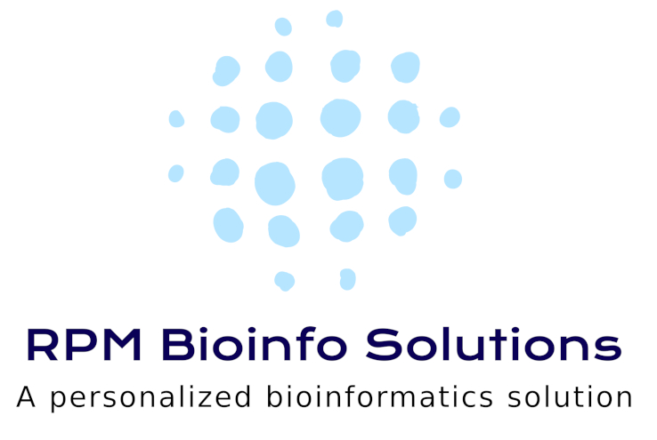
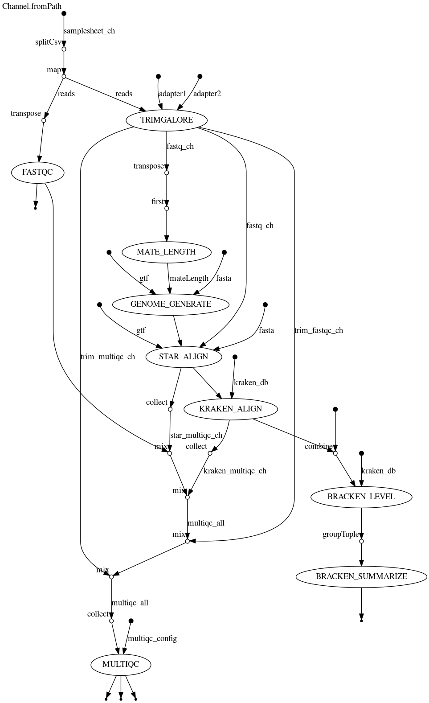

# Path-seq


## Sequencing pipeline
Contains scripts for Non-host alignment on RNA-Seq data

<!-- badges: start -->

[](https://www.nextflow.io/)
[](https://www.docker.com/)
[](https://doi.org/10.5281/zenodo.7942423)

<!-- badges: end -->

## Introduction

**rpmbioinfo/pathseq** is a bioinformatics pipeline that can be used to align unampped RNA sequencing data ,from a given organism with a reference genome, against microbial genomes for metagenomic quantification


## Dependencies

- Nextflow

A Conda environment has been setup for all users to give access to dependencies and should be active by default upon login. 

- Python (version 3.9.5)
    - boto3/botocore
    - pandas
    - getpass
    - flatten-dict
    - platform
- AWS CLI v2

### AWS setup
The Python master script is made to facilitate reading S3 buckets to automatically generate samplesheets and then launch the nextflow run with appropriate parameters. 
This is dependent on a specific setup installed either on your local machine or on an AWS AMI. 

**However**, without this setup, the Nextflow workflow is still functional as a standalone package, it simply requires more work to generate a samplesheet and understand Nextflow parameters. 


## Workflow
The pipeline accepts either a local directory or S3 URI as input, where paired-ended fastq files are stored. 




1. **OPTIONAL** By default  the pipeline will attempt to trim adapters with Trimgalore: it will try to find the appropriate adapter automatically, unless adapters are specified on the command line with the associated parameters, but this can be turned off. 
2. Reads , either raw or trimmed, will be mapped to a reference genome using STAR
3. Unmapped reads will then be aligned using Kraken2, to one of 3 possible Kraken index databases: **standard**, **viral** or **eupath**. You can also supply your own kraken index. 
4. Bracken will be used to calculate relative and absolute abundances for each samples at each taxonomic level (Domain,Phylum,Class, Order, Family, Genus, Species )
5. a MultiQC report will be generated


## Usage

Consistent with nf-core standards, the workflow expects a samplesheet with your input data:
**samplesheet.csv**:
```csv
sample,fastq_1,fastq_2
SAMPLE1,Sample1_L001_R1_001.fastq.gz,Sample1_L001_R2_001.fastq.gz
SAMPLE2,Sample2_L001_R1_001.fastq.gz,Sample2_L001_R2_001.fastq.gz
```

If you are able to use the Python script \(see AWS setup subsection above\), the script generates that samplesheet automatically when provided with a local path or S3 URI. 

Thus, you can start the pipeline with the Python script. 

You can use its help section for further information


```bash
python pathseq_master.py --help  

required arguments:
  -i INPUT, --input INPUT
                        [i]nput directory/S3 bucket with raw data (required)
  -o OUTPUT_BUCKET, --output_bucket OUTPUT_BUCKET
                        [o]utput S3 bucket directory with outputdata (required)
  -g {GRCh38,GRCm38,Mmul_10}, --genome {GRCh38,GRCm38,Mmul_10}
                        reference [g]enome for alignment. (required)
  -k {viral,standard,eupath}, --kraken {viral,standard,eupath}
                        [k]raken index for alignment. (required). Defaults to standard. More details at
                        'https://benlangmead.github.io/aws-indexes/k2'

optional arguments:
  -e EMAIL, --email EMAIL
                        [e]mail for notifications of pipeline status (optional) if NOT for the user.
  --sampleglob SAMPLEGLOB
                        Glob to capture samplename (optional)
  --dryrun              Activates test mode, which does not launch the run on AWS Batch. Defaults to FALSE.
                        Returns the Nextflow command. Useful if you only wish to generate the samplesheet, but
                        supply your own '-params_file' or tweak parameters further.
  --config CONFIG       nextflow [c]onfiguration file. Defaults to the /home/adampelletier/conf/aws.config.
  -t, --skiptrim        deactivates read [t]rimming with cutadapt. Uses adapters specified with adapter1 and
                        adapter2 parameters, or attempts to automatically detects adapters. 
  --adapter1 ADAPTER1   adapter sequence (#1) used for trimming. Defaults to 'NONE'
  --adapter2 ADAPTER2   adapter sequence (#2) used for trimming., Defauls to 'NONE'


```

You could simply run the pipeline using this command:

```python

python pathseq_master.py -i s3://my-bucket/userdata/pathseq_fastqs -o s3://my-bucket/userdata/pathseq_output -g GRCh38

```

### Reference genomes
With the aformentioned AWS setup, the Python script scans the available genomes in your reference bucket, and may offer additional choices than those presented above if those genomes were added to the bucket. 
You could also simply pass a fasta and gtf file to the Nextflow workflow. 


## Outputs
The S3 output location will contain a subdirectory for different tasks:

- Kraken reports
- Kraken files \(contains more information that can be useful for downstream analysis\)
- STAR logs
- Bracken summaries
- MultiQC report, data and plots.


## Downloading your data
After your run, if you wish to transfer your preprocessed data to your computer for downstream analysis, you can use either the S3 console \(for smaller files\) or the AWS CLI \(more information [here](https://awscli.amazonaws.com/v2/documentation/api/latest/reference/s3/index.html)\)

For instance, a sync command would get all files , including nested directories
```bash 
aws s3 sync s3://my-bucket/userdata/pathseq_output localdirectory/pathseq/preprocessed_data
``` 


## Credits

These scripts were originally written for use in Rafick-Pierre Sekaly's [PATRU group](https://med.emory.edu/departments/pathology/research/patru/people/patru-faculty.html) at Emory University. 
The pipeline was written in Nextflow DSL2 and is primarily maintained by Dr. Adam-Nicolas Pelletier ([@anp83](https://github.com/anp83)) 

